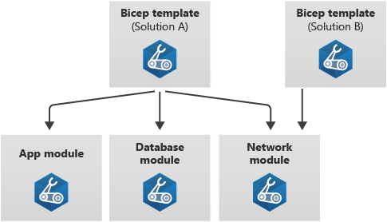

# Introduction 
This repository is a collection of Bicep modules allowing to deploy resources to Azure with respect to best practices and standards.

**<u>Definition</u>:** Bicep modules enable you to break a complex template into parts. You can ensure that each module is focused on a specific task, and that the modules are reusable for multiple deployments and workloads.

Bicep modules benefits are : Reusability, Encapsulation and Composability.

Microsoft provides a great learning path for Bicep: <a href="https://learn.microsoft.com/en-us/azure/azure-resource-manager/bicep/learn-bicep" target="_blank">Learn modules for Bicep</a>.